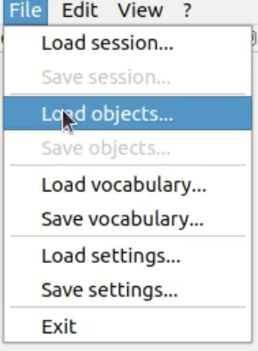

# Explore and Find Node

## Overview

This project extends the `frontier_exploration` ROS node to enable external control by detecting specific signals like warnings or stops. It combines environment exploration with object detection.

## Features

- **Exploration**: Uses `frontier_exploration` to map unknown areas.
- **Object Detection**: Integrates with `find_object_2d` to identify objects in images.
- **Signal Handling**: Stops or raises the robot's arm based on detected signals.

## Installation

1. **Clone the repositories**:
    
    ```sh
   cd roscd
   cd ../src
    ```

    - Our custom Explore and Find node:
      ```sh
      git clone https://github.com/elenaalegret/explore_and_find.git
      ```
    - Edited `frontier_exploration` with **added subscribers**:
      ```sh
      git clone https://github.com/elenaalegret/frontier_exploration.git
      ```
    - `find_object_2d` repository:
      ```sh
      git clone https://github.com/introlab/find-object.git
      ```

2. **Install ROS packages**:
   - Follow the instructions in each repository for dependencies and setup.

3. **Build the package**:
   ```sh
   cd ~/catkin_ws
   catkin_make
   ```

## Usage

1. **Launch the nodes**:

   - T1: `roscore`
   
   - T2: `ssh ubuntu@{robot_ip}`
   - T2: `roslaunch turtlebot3_bringup turtlebot3_robot.launch`
   
   - T3: `ssh ubuntu@{robot_ip}`
   - T3: `roslaunch turtlebot3_bringup turtlebot3_rpicamera.launch`
   - T4: `roslaunch turtlebot3_slam turtlebot3_slam.launch slam_methods:=gmapping`
   - T5: `roslaunch explore_and_find explore_and_find_with_camera.launch`
     - Load the `signals` folder into the interface where the camera feed is displayed.
     - 
   - T6: `roslaunch turtlebot3_navigation move_base.launch`


## Package Structure

```plaintext
.
├── CMakeLists.txt
├── launch
│   └── explore_and_find_with_camera.launch
├── package.xml
├── scripts
│   └── explore_and_find.py
└── signals
    ├── 1.png
    └── 2.png
```

- **CMakeLists.txt**: Configures the build system for the project in ROS.
- **launch/explore_and_find_with_camera.launch**: ROS launch file to start the nodes required for the system, including `frontier_exploration`, `find_object_2d`, and `explore_and_find.py`.
- **package.xml**: Describes the ROS package, including dependencies and metadata.
- **scripts/explore_and_find.py**: Implements the `explore_and_find` node, combining environment exploration and object detection.
- **signals/1.png**: Image file representing a **Warning** signal.
- **signals/2.png**: Image file representing a **Stop** signal.

